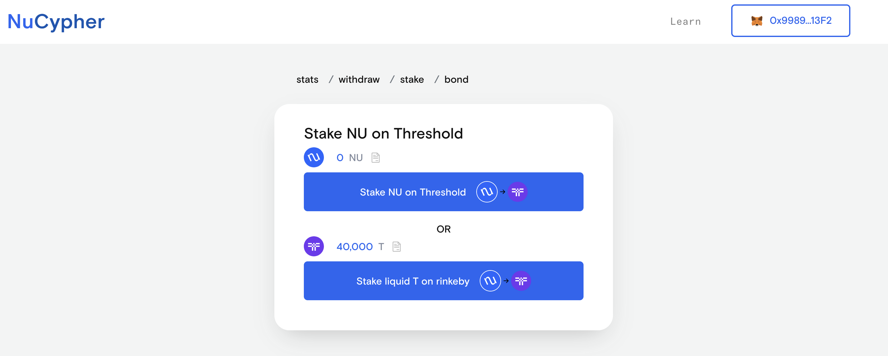
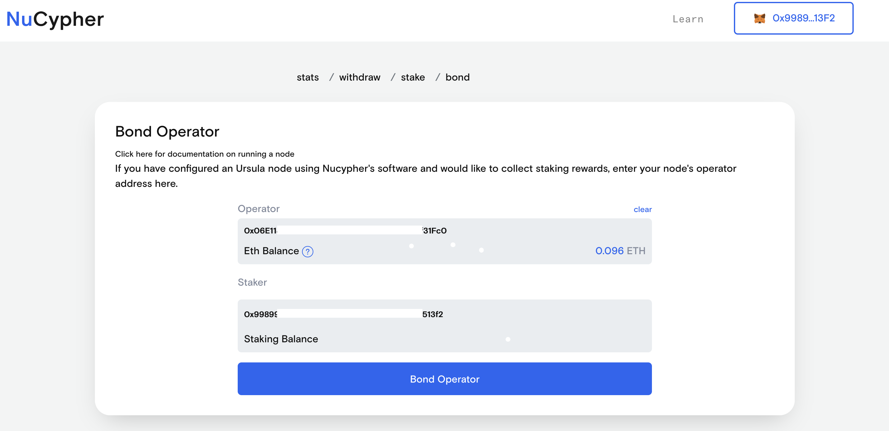

.. _heco-testnet:

=============
heco Testnet
=============

NuLink provides a public testnet running on the Ethereum heco testnet meant for staking providers and node operators
to learn how to set up a PRE application node, as well as for internal development purposes.

The Threshold Token (NLK) contract address for the testnet is ``0xc3871E2C11Ff18d809Bce74d1e4229d561aa3F09``.
You can view it on `etherscan <https://testnet.hecoinfo.com/en-us/address/0xc3871E2C11Ff18d809Bce74d1e4229d561aa3F09?tab=Transactions>`_.

.. attention::

    This testnet is currently being migrated to Threshold Network.

Stake and Bond
--------------
You need some heco testnet ETH and 40,000 NLK in a metamask wallet.
Ask in the discord if you need help with this.

Navigate to the `Testnet Staking Dashboard <https://to/be/supplied/stake>`_ and connect your metamask wallet.
Go to the **stake** tab and click "Stake liquid NLK on mainnet"

Allow the 1000 wei NLK spend, and then stake it.
Both transactions will require authorization via metamask.
You can ignore the **Configure Addresses** option - they should all default to the currently connected account.

Once those transactions are confirmed, switch to the **bond** tab.
Here you will paste the Operator address that is being printed by the docker logs:

